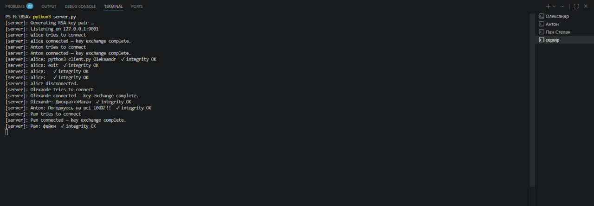

# lab2_crypt — Secure Terminal Chat

A terminal-based chat application with encrypted messaging using RSA key exchange, XOR symmetric cipher, and SHA-256 message integrity checks.

## How to run

**Requirements:** Python 3.10+, no external libraries needed.

```bash
# Terminal 1 — start the server
python3 server.py

# Terminal 2 — first client
python3 client.py alice

# Terminal 3 — second client
python3 client.py bob
```

## Implementation

The security is built in two layers: **RSA** for the initial key exchange, and a **symmetric XOR cipher** for the actual messages. This hybrid approach is intentional — RSA is too slow to encrypt every message, so it's only used once to securely deliver a random symmetric key to each client.

### RSA (implemented from scratch, no libraries)

Key generation:
1. Generate two random primes `p` and `q` (~256 bits each, so `n = p*q` is ~512 bits)
2. Compute `n = p * q` and `φ(n) = (p−1)(q−1)`
3. Use `e = 65537` as the public exponent (standard Fermat prime)
4. Compute `d = e⁻¹ mod φ(n)` using the extended Euclidean algorithm

Primality is tested with the **Miller-Rabin** probabilistic test (10 rounds).

Encryption: `c = m^e mod n`  
Decryption: `m = c^d mod n`

### Key exchange protocol

```
Client                                     Server
  |── username (plaintext) ───────────────►|
  |◄── server RSA public key ──────────────|
  |── client RSA public key ──────────────►|  generates random 32-byte sym_key
  |◄── RSA_encrypt(sym_key, client_pub) ───|
  | sym_key = RSA_decrypt(enc, client_priv)
  |════════ Secure channel established ════|
```

Each client gets a **unique** symmetric key — so the server re-encrypts every broadcast message separately per client.

### Message format (every message)

```
Send:
  1. hash     = SHA256(plaintext)
  2. encrypted = XOR(plaintext, sym_key)
  3. send JSON: {"hash": hash, "data": encrypted.hex()}

Receive:
  4. plaintext = XOR(encrypted, sym_key)
  5. verify: SHA256(plaintext) == hash
```

SHA-256 comes from Python's standard `hashlib`. The XOR cipher is implemented manually. Messages are framed with a 4-byte length prefix to handle TCP fragmentation.

### Files

| File | Description |
|------|-------------|
| `rsa_impl.py` | RSA from scratch: Miller-Rabin, key generation, encrypt/decrypt |
| `crypto_utils.py` | XOR cipher, SHA-256 hashing, socket framing, message packing |
| `server.py` | Server: accepts connections, performs key exchange, relays messages |
| `client.py` | Client: key exchange, send/receive encrypted messages |

## Screenshots

**Server + three clients connected:**


